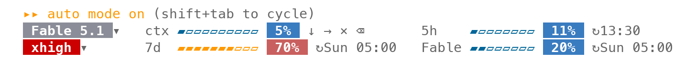
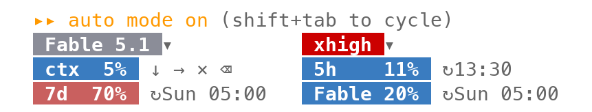

# statusbar：Claude Code 的用量狀態列

[English](README.en.md)

在 Claude Code 輸入框下方加兩列狀態列（終端機比較窄時是三列），任何專案都能用：



```
⏵⏵ auto mode on (shift+tab to cycle)
 Opus 5.5 ▾   ctx ▰▰▱▱▱▱▱▱▱▱  24%  ↓ → × ⌫      5h    ▰▱▱▱▱▱▱▱  9%  ↻19:00
 xhigh ▾      7d  ▰▰▰▰▱▱▱▱▱▱  35%  ↻Sun 05:00   Fable ▰▱▱▱▱▱▱▱  17%  ↻Sun 05:00
```

- **模型、effort**：膠囊樣式，模型是灰底。effort 依等級上色：low 綠、medium 黃、high 橘、xhigh 和 max 紅。按膠囊右邊的 ▾ 等於送出 `/model`、`/effort`，直接打開切換選單；切換後膠囊立刻跟著變。
- **ctx**：這段對話用掉多少上下文視窗。開 session、`/clear` 或 compact 之後、模型第一次回覆之前，Claude Code 還沒有這個數字，這時顯示本機估算值（系統提示、工具、記憶檔與對話已經佔掉的量；不發請求、不呼叫模型），回覆後換成實際值。`/resume` 接回的對話顯示它最後一次回覆時的實際值。百分比右邊空一格是四顆鈕。滑鼠移到鈕上，旁邊會浮出反白的名稱標籤，暫時蓋住 5h 那一欄，移開就消失：
  - `↓` 等於在輸入框送出 `/compact`；模型正在回覆時，會排隊等這一輪結束再壓縮。
  - `→` 等於在輸入框打「繼續工作」再按 Enter，按一次就送出；模型正在回覆時，會等這一輪結束再送出。
  - `×` 等於送出 `/clear`。
  - `⌫` 清空輸入框，按一次就清。Claude 工作中按 Esc 會中斷這一輪，不會清掉打到一半的字；這顆鈕只清輸入框，工作照常進行。
  - `↓`、`×` 會改掉整段對話，都要按兩次，免得誤觸：第一次按下變成 `↓ compact?` 或 `× clear?`，3 秒內再按同一顆才送出，否則恢復原狀。
- 符號的分工：`▾` 是打開選單；`→` 是請模型繼續；`↓`（往下壓）和 `×`（清掉）是對這段對話動手；`⌫`（往左刪除）只動輸入框。
- **5h、7d**：5 小時與每週的用量額度，後面是重置時間。訂閱帳號才有這兩項。
- **Fable**：Fable 的每週用量，後面是重置時間。帳號有 Fable 額度才顯示。
- 進度條依用量上色：未滿 50% 綠、未滿 75% 黃、未滿 90% 橘、其餘紅。百分比膠囊的底色：未滿 50% 藍、未滿 75% 玫瑰紅、其餘紅。
- 百分比膠囊固定白字、深色底，不跟著主題變。
- Claude Code 自己的提示列（`? for shortcuts`、`auto mode on`）照常顯示在最上面，狀態列在它下面。

終端機不到 85 欄時，改成三列兩欄、不畫進度條的窄版。模型和 effort 分別在兩欄的最上面，用量的標籤放進百分比膠囊，所以每一欄的膠囊都對齊。用量的配對和寬版一樣：



窄版大約要 49 欄。再窄的話，5h、Fable 那欄會從尾巴切掉，最先切掉的是重置時間。

## 需求

- Claude Code 2.1.290 以上（以這一版測試）。mod 的 API 目前是 early access，Claude Code 改版時，這個 mod 可能要跟著更新。
- 用滑鼠點按鈕（`▾`、`↓`、`→`、`×`、`⌫`）需要 Claude Code 的全螢幕版面（settings.json 的 `"tui": "fullscreen"`）。沒開全螢幕時，按鈕點了沒有反應。

## 安裝

在 Claude Code 的輸入框輸入：

```
/plugin install statusbar --marketplace MomoChenisMe/claude-code-mods
```

第一次會問要不要加入 `github:MomoChenisMe/claude-code-mods` 這個 marketplace，回答 `y`；範圍選 user，每個專案都會載入。

它和 settings.json 的 `statusLine` 是兩樣東西，可以同時存在。如果不想看到兩行，就把 `statusLine` 拿掉。

## 已知限制

- 開 session、`/clear` 或 compact 之後的 ctx 是估算值，和第一次回覆後的實際值大約差 1 個百分點。
- `→` 送出的「繼續工作」是固定的中文，不能改，也不跟著語言設定變。
- `↓` 等第二次按下的 3 秒內，旁邊多出 `compact?`，右邊那一欄會往右移 4 格；按下或逾時後回到原位。
- ▾ 是膠囊旁的小符號，不是整顆膠囊：mod 的按鈕不能設定字的顏色，白字膠囊只能是文字。
- Claude Code 沒有把 Fable 的用量交給 mod，所以 statusbar 在背景跑 `claude -p /usage` 讀出來：開 session 時一次，之後最多每 5 分鐘一次，每次約 2～4 秒、不呼叫模型。Fable 數字因此最多落後 5 分鐘。
- 切換 `/model` 後，模型名稱立刻變；但 `/model` 的輸出不含 effort，所以 effort 要等下一次送出訊息才更新。
- effort 是從 `/effort` 的英文輸出 `Set effort level to …` 讀出來的。Claude Code 改了這句話時，effort 一樣會在下一次送出訊息時更新。

## 開發

```bash
claude plugin validate statusbar
claude plugin test statusbar
```

本機開發方式見 [repo 的 README](../README.md#開發)。
