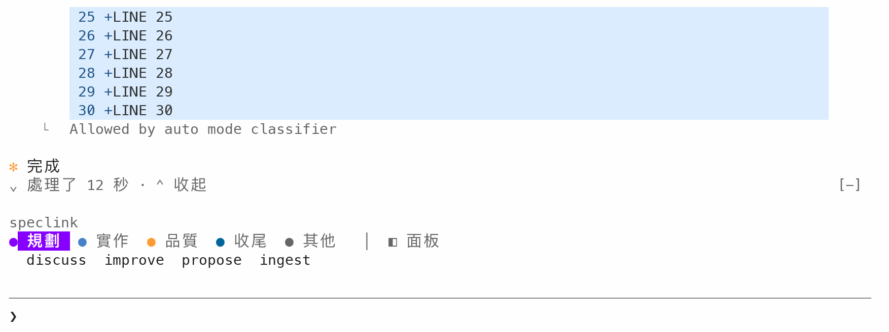

# tidy: fold away Claude Code's work in progress

[繁體中文](README.md)

Everything that Claude writes to you stays. The tool calls and the thinking between those texts fold, one line for each stretch of work, and each line opens on a click. The labels are in Traditional Chinese for now.

## Features

### 1. The work folds into one line

Every text that Claude writes stays in the conversation. Between two texts, the tool calls and results, the thinking that the screen shows and the messages that arrive while Claude works fold into one `› 處理了 N 秒` line ("worked for N seconds") for each stretch.


- **Your message**: keeps Claude Code's own grey style. tidy does not change it.
- **Claude's texts**: the leading dot becomes a bold orange `✻`, and wrapped lines indent two cells to align. When Claude writes a note before it starts to work, the note stays too.
- The time of each stretch counts from the text before it to the text after it. When a tool fails, the line adds the count: `› 處理了 1 分 23 秒 · 1 個錯誤` ("1 min 23 s · 1 error").
- **When Claude asks you something** (AskUserQuestion, or ExitPlanMode to approve a plan): the question stays in the conversation and does not fold into a stretch.
- The `Worked for …` line at the end of each turn is hidden, because the time is already on the folded lines.

### 2. Open the work

Click `›` and it turns into `⌄`. That stretch of work shows as Claude Code draws it, indented two cells under the line. Click again to fold it. Each stretch opens and folds on its own.


When the opened work is long and you scroll so far that the `⌄ 處理了` line is out of view, a `⌄ 處理了 N 秒 · ⌃ 收起` row ("⌃ fold") shows above the prompt. Press `⌃ 收起` to fold that stretch and scroll back to its line, so you do not have to scroll back yourself. When the line is in view again, the row goes away.



### 3. The elapsed time and the current step while Claude works

While Claude works, the stretch in progress reads `› 處理中 N 秒 · <current step>` ("working N s · …"):


- The time counts from the start of the stretch (after the text before it; the first stretch starts with the turn) and changes every second. When the stretch ends, the line changes to `› 處理了 N 秒`.
- While a tool runs, the line names the tool and its argument, for example `執行：Run the tests` ("run: …") or `讀取 register.tsx` ("read …"). With several tools at once it adds "等 n 項" ("and n more").
- After a tool finishes, the line keeps the latest step until the next tool starts or the model writes new thinking (it then shows the first sentence of that thinking).
- A long line is cut to fit one row.

### 4. Subagent report cards

A subagent report that arrives after the answer starts a new turn, so it stays in the conversation as a one-row card: the type, the task description, and the status and time from the finish notice (完成 means "done", 回報 means "report").


Click the row to show the full report under it, indented two cells; Claude Code gives the opened message a light grey background. Click again to fold it. When the subagent failed or was stopped, the `◆` and the status are red.


### 5. Other rows that fold away

- The `(ctrl+b to run in background)` hint under a running command.
- A subagent report (`Message from @…`) that arrives while Claude works. It folds into the stretch of work at that time.
- The notice that a background task finished (`Agent "…" finished`, `Background command "…" completed`). One that arrives while Claude works folds into the stretch at that time. One that arrives after the answer folds into the stretch that started the task.

## Requirements

- Claude Code 2.1.290 or later (tested with 2.1.291 and 2.1.292). The mod API is in early access, so this mod may need an update when Claude Code changes.
- Clicking `›` needs Claude Code's fullscreen layout (`"tui": "fullscreen"` in settings.json). Without it the work still folds, but the click does nothing.

## Install

Type this in the Claude Code prompt:

```
/plugin install tidy --marketplace MomoChenisMe/claude-code-mods
```

The first time, Claude Code asks whether to add the `github:MomoChenisMe/claude-code-mods` marketplace. Answer `y`, and pick the user scope so every project loads it.

To stop using it, disable tidy in `/plugin`. The screen goes back to how Claude Code draws it.

## Known limits

- tidy only folds the conversation after it loads. Rows that were on screen before it loaded, and old conversations you bring back with `--resume`, stay as they were.
- Permission prompts, question dialogs and slash command output show as usual.
- When Claude starts several subagents at once, Claude Code draws them as one `N background agents launched` row. A mod cannot draw over that row, so it stays. For such a stretch, the `›` line shows above the text that comes next.
- The `※ recap:` summary that shows when you come back after some time is also drawn by Claude Code itself and stays. To turn it off, use `/config`.
- tidy changes the drawing only: the transcript, the full record that `ctrl+o` opens and what the model reads stay the same.

## Development

```bash
claude plugin validate tidy
claude plugin test tidy
```

See the [repo README](../README.en.md#development) for local development.
